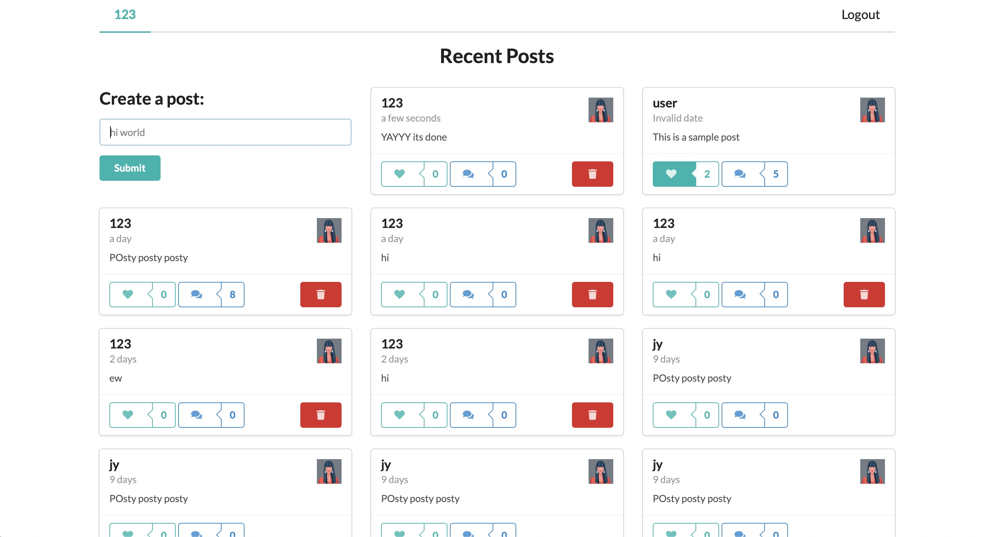
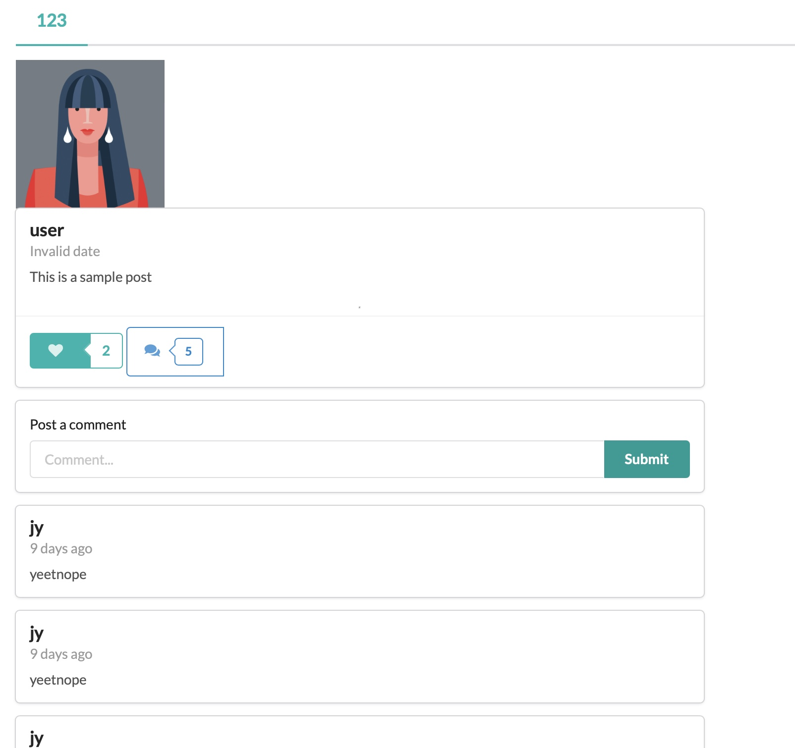
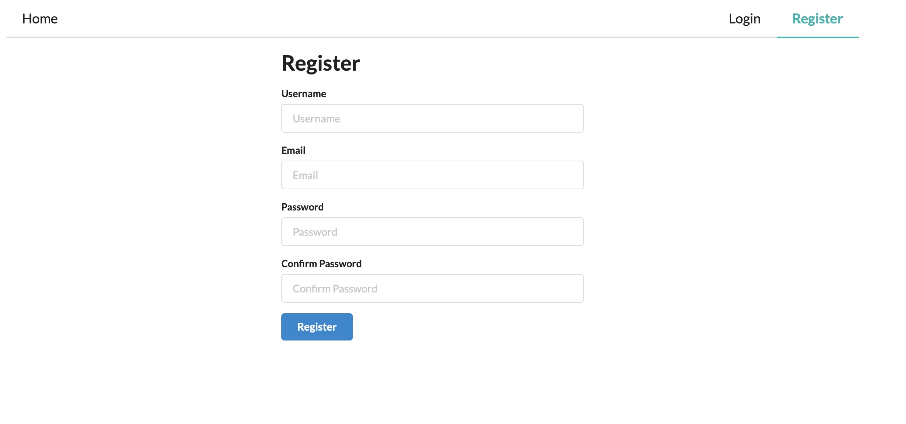

Sample App I created with the help of this tutorial:https://www.youtube.com/watch?v=n1mdAPFq2Os

Server is deployed on Heroku: https://git.heroku.com/ffc-merng-tutorial-server.git

# Link to Site: https://competent-hamilton-66bb48.netlify.app

# Main Page

# Comments Page

# Register Page

